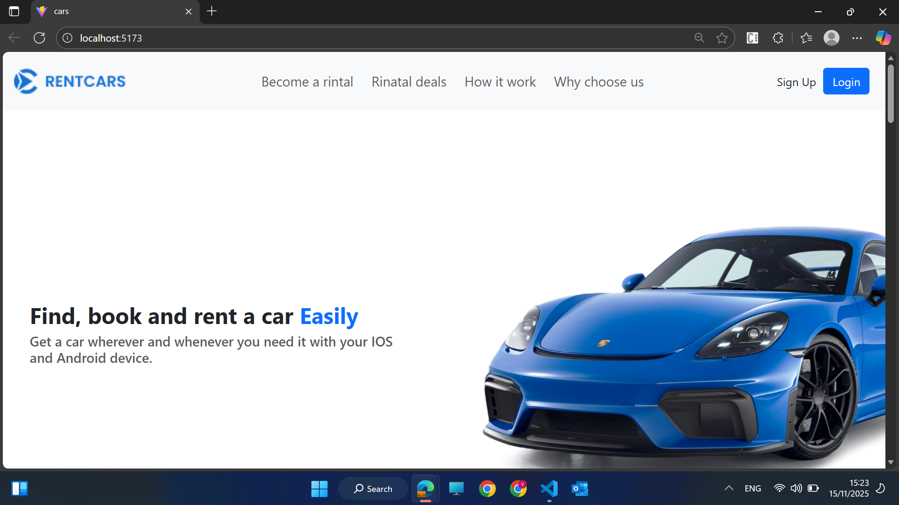
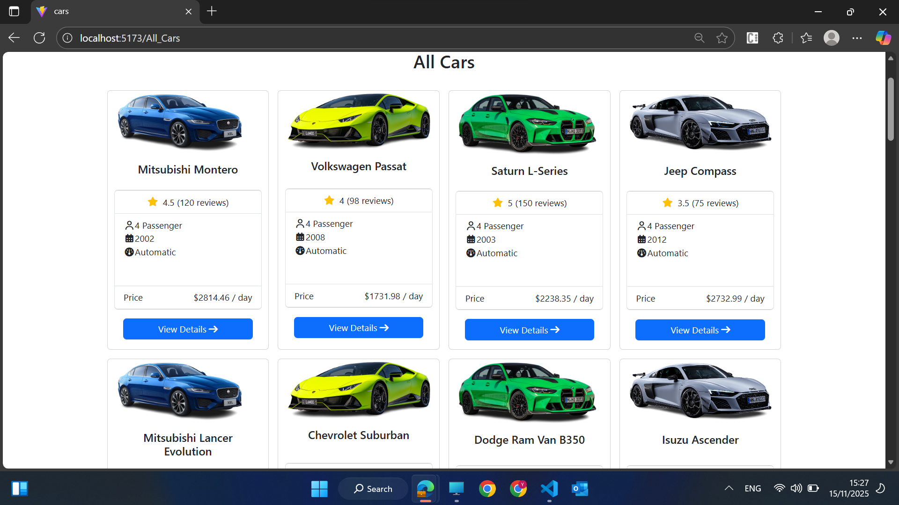
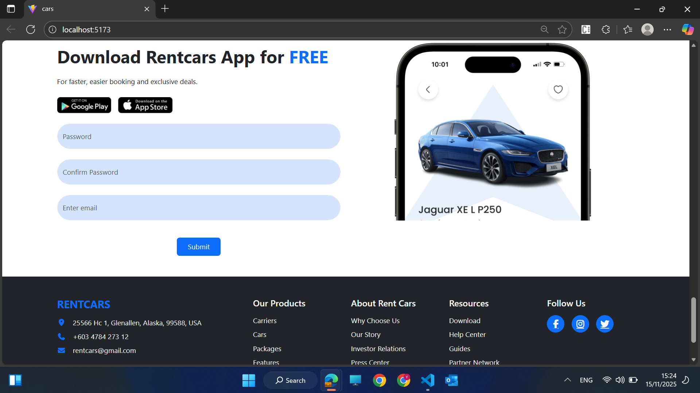
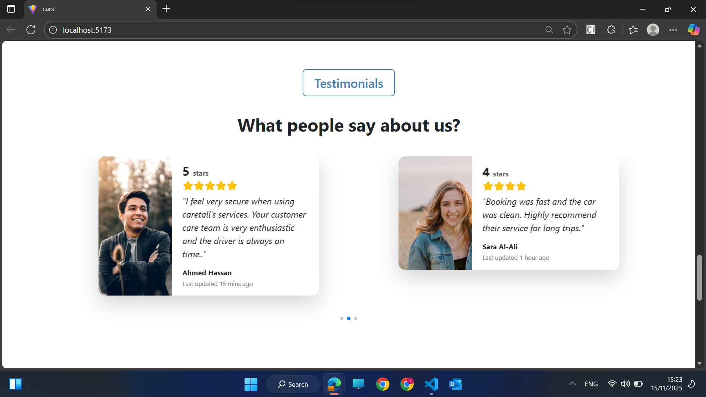
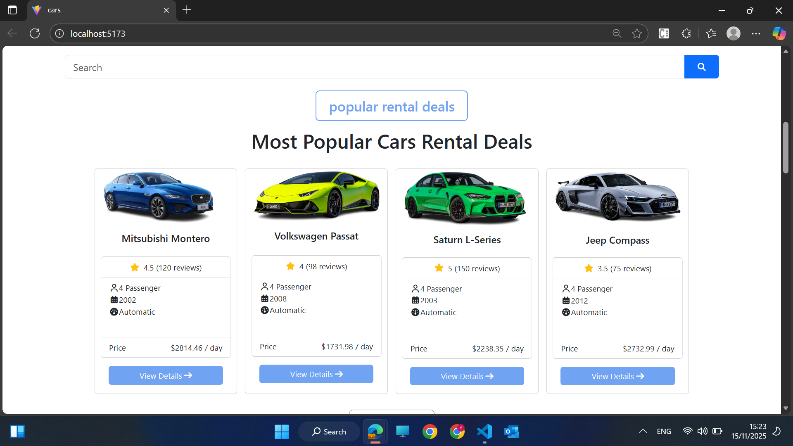
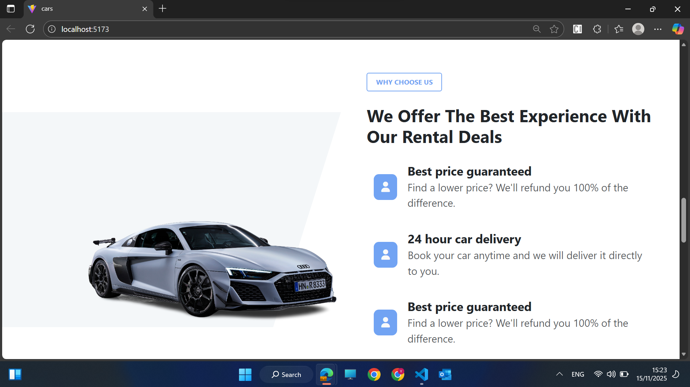

# 🚗 **RentCars – Car Rental Website**

RentCars is a modern and responsive **Car Rental Website** built using **React**, **Vite**, **Bootstrap**, and **Swiper.js**.  
The project provides a clean, user-friendly interface to explore car rentals, features, testimonials, and contact information.

---

## 📌 **Features**
- Fully responsive UI  
- Modern homepage layout  
- Testimonials slider (Swiper.js)  
- Footer with contact details and social media icons  
- Clean and organized component structure  
- FontAwesome icons integration  
- Reusable and maintainable components  

---

## 🛠️ **Tech Stack**
- **React.js**
- **Vite**
- **Bootstrap 5** / **Tailwind CSS**
- **Swiper.js**
- **FontAwesome Icons**

---

## 📸 **Screenshots**

### 🏠 Home Page

### 🚗 All Cars Page

### 📞 Contact Page

### ⭐ Testimonials

### 🔥 Popular Cars

### 📝 About Us

